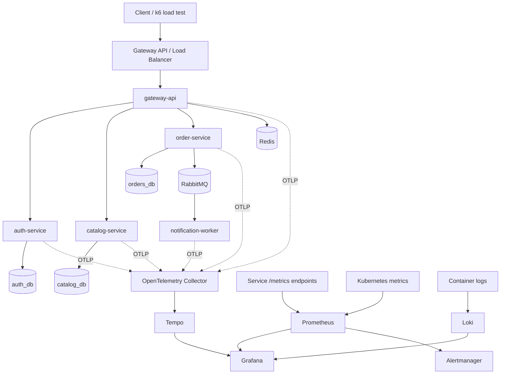
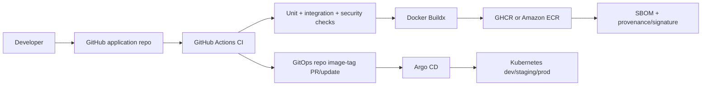

# KubeCommerce Platform

A production-style, independently deployable Python/FastAPI microservices platform:
built, tested, containerized, deployed to Kubernetes, secured, observed, autoscaled,
and continuously delivered.

> Source of truth for scope and requirements: `project_1_kubernetes_cicd_microservices.md`.
> **Status:** Phase 0 (engineering standards, docs, scripts) with the application
> services being built alongside it. Sections below mark what is *implemented now* versus
> *planned* by phase. Nothing is claimed before it is built.

## Problem statement

It is easy to demonstrate a single `kubectl apply` or a toy container. It is harder to
show a complete operational lifecycle: source code -> tested artifact -> immutable,
scanned image -> GitOps-managed Kubernetes rollout -> autoscaling, self-healing,
observability, and rollback under load. KubeCommerce builds a small but realistic
e-commerce order-processing system in order to prove that lifecycle end to end.

## What you build

Five independently containerized Python components plus shared backing services:

| Service | Responsibility | Data ownership | Container port |
|---|---|---|---|
| `gateway-api` | Public API entry point, JWT verification, correlation IDs, rate limiting, consistent errors | none (Redis for rate limits) | 8000 |
| `auth-service` | Registration/login, RS256 JWT issuance, JWKS, `/me` | `auth_db` | 8000 |
| `catalog-service` | Product catalog + inventory, Redis read-through cache | `catalog_db` + Redis | 8000 |
| `order-service` | Create/read orders, inventory validation, transactional outbox | `orders_db` | 8000 |
| `notification-worker` | Consumes `order.created`, idempotent, retries + DLQ, simulated notification | queue only (Redis for idempotency) | 8000 |

Shared infrastructure: PostgreSQL, Redis, RabbitMQ, Kubernetes, Helm, GitHub Actions,
Argo CD, Prometheus/Grafana/Alertmanager, Loki, Tempo + OpenTelemetry.

## Architecture



### Delivery architecture



CI builds and publishes artifacts; Argo CD reconciles deployment state from Git. CI does
not hold broad production cluster credentials. See `docs/architecture.md` for details.

## Tech stack

| Area | Choice |
|---|---|
| Language / runtime | Python 3.12 |
| Web framework | FastAPI + Uvicorn |
| Data access | SQLAlchemy 2 async, asyncpg, Alembic migrations |
| Settings / validation | Pydantic v2 + pydantic-settings |
| Auth | PyJWT (RS256), argon2 password hashing, JWKS |
| Cache / rate limit | Redis (`redis.asyncio`) |
| Messaging | RabbitMQ (`aio-pika`), transactional outbox, DLQ |
| Logging | structlog (JSON) |
| Metrics / tracing | prometheus-client, OpenTelemetry (OTLP HTTP) |
| Packaging | `uv` per-project (independent projects, path deps) |
| Lint / types / test | Ruff, MyPy, Pytest, pre-commit |
| Containers / local | Docker multi-stage, Docker Compose |
| Kubernetes / delivery | kind, Helm, Gateway API, Argo CD, GitHub Actions |
| Observability stack | Prometheus, Grafana, Alertmanager, Loki, Tempo + OTel Collector |
| IaC / cloud (later) | Terraform, AWS EKS, ECR, Secrets Manager, ESO, Pod Identity |

## Repository layout

```text
kubecommerce/
├── services/
│   ├── gateway-api/          # FastAPI, own pyproject/uv.lock/.venv
│   ├── auth-service/
│   ├── catalog-service/
│   ├── order-service/
│   └── notification-worker/
├── libs/
│   ├── contracts/            # kubecommerce_contracts (event envelope + topics)
│   └── observability/        # kubecommerce_observability (logging/metrics/tracing/health)
├── docs/
│   ├── architecture.md
│   ├── runbook.md
│   ├── security.md
│   └── slo.md
├── scripts/
│   ├── dev-bootstrap.sh
│   ├── smoke-test.sh
│   ├── load-test.sh
│   └── typecheck.sh
├── tests/load/order-flow.js  # k6 load test
├── Makefile
├── .pre-commit-config.yaml
├── .editorconfig
├── .env.example
└── CODEOWNERS
```

The GitOps/configuration repository (`kubecommerce-gitops`) is introduced in Phase 8.

## Prerequisites

| Tool | Needed for | Required now? |
|---|---|---|
| Python 3.12 | running services/tests | yes |
| `uv` | dependency management (`make install/test`) | yes |
| `openssl` | local JWT key generation (`dev-bootstrap.sh`) | recommended |
| Docker Engine/Desktop | Compose (Phase 3), image builds | Phase 3+ |
| `kubectl` | local cluster inspection (Phase 4+) | Phase 4+ |
| kind (or k3d) | local Kubernetes (Phase 4+) | Phase 4+ |
| Helm | packaging/installing charts (Phase 5+) | Phase 5+ |
| k6 | load testing (`make load-test`) | Phase 3+/Milestone 3 |
| trivy | security scans (`make security-scan`) | Phase 7+ |
| pre-commit | git hooks (`make install`) | optional |

Install the Python tooling for this repo:

```bash
# uv (if not already installed)
curl -LsSf https://astral.sh/uv/install.sh | sh
export PATH="$HOME/.local/bin:$PATH"
```

Docker, kind, kubectl, Helm and k6 are not installed in this working copy; targets that
need them fail with a clear message. See `docs/runbook.md` for cluster install steps.

## Quickstart

```bash
# 1. Generate local keys (.secrets/) and a .env from the template, then install deps
bash scripts/dev-bootstrap.sh
make install

# 2. Run unit tests and linting (no Docker required)
make test
make lint

# 3. Start the full local stack (requires Docker + compose.yaml, Phase 3)
make compose-up

# 4. Exercise register -> login -> product -> order end to end
make smoke-test

# 5. Stop the stack
make compose-down
```

`make` on its own lists all targets.

## Make targets

| Target | Purpose | Requires |
|---|---|---|
| `make install` | `uv sync` every `libs/*`/`services/*` + install pre-commit hooks | uv |
| `make lint` | Ruff check + format check per project | uv |
| `make typecheck` | MyPy per project (`scripts/typecheck.sh`) | uv |
| `make test` | Pytest per project (unit; integration deselected) | uv |
| `make integration-test` | Compose up + cross-service tests | Docker, compose.yaml (Phase 3/C) |
| `make compose-up` / `make compose-down` | Start/stop local stack | Docker |
| `make build` | Buildx images tagged with Git SHA (+ `latest-dev` locally) | Docker |
| `make kind-up` / `make kind-down` | Create/delete local kind cluster | kind (Phase 4) |
| `make helm-install` | Install/upgrade chart into `kubecommerce-dev` | Helm (Phase 5) |
| `make smoke-test` | End-to-end smoke test | running stack |
| `make load-test` | k6 order-flow load test | k6 |
| `make security-scan` | Trivy filesystem/config scans | trivy |
| `make clean` | Remove caches, venvs, artifacts | - |

## Environments

| Environment | Purpose | Runtime | Namespace |
|---|---|---|---|
| `dev` | Fast developer validation | kind/k3d (local) | `kubecommerce-dev` |
| `staging` | Production-like integration/release validation | kind/k3d initially, EKS later | `kubecommerce-staging` |
| `prod` | Controlled release demonstration | EKS (Phase 13/later) | `kubecommerce-prod` |

For a low-cost portfolio, dev and staging are **namespaces in one local kind cluster**.
AWS/EKS is **Phase 13 (later)**, not part of the local core. Configuration is
environment-driven (`.env` locally, ConfigMaps/Secrets + Helm values per environment).
See `docs/architecture.md` section 13 for the full variable table.

## Observability evidence checklist

Required evidence for the completed project (see phase for status):

| Signal | Required evidence | Phase |
|---|---|---|
| CPU | Grafana panel by service/pod | 9 |
| Memory | working set and limit comparison | 9 |
| Pod restarts | graph/table with restart count | 9 |
| Request rate | requests/sec per service | 9 |
| Response time | p50/p95/p99 latency | 9 |
| Error rate | 4xx/5xx and percentage | 9 |
| HPA | desired/current replicas | 9 |
| Queue | RabbitMQ queue depth and failures | 9 |
| Logs | Loki query with correlation IDs | 10 |
| Traces | distributed request trace in Tempo | 10 |
| Alerts | at least 5 useful Prometheus rules | 9 |

## Definition of Done

Checklist mirrors guide section 11. Checked = implemented and demonstrated.

- [ ] Five independently containerized Python components exist.
- [ ] Local Compose environment works.
- [ ] Local Kubernetes deployment works.
- [ ] Helm packages the application.
- [ ] Config and secrets are separated.
- [ ] All services have meaningful readiness/liveness behavior.
- [ ] Requests/limits are defined and justified after testing.
- [ ] HPA visibly scales under load.
- [ ] Multiple replicas survive pod termination.
- [ ] PDB and topology spreading are present for production services.
- [ ] NetworkPolicy is implemented and tested.
- [ ] CI runs tests/security checks.
- [ ] Registry images are immutable and scanned.
- [ ] SBOM/provenance exists.
- [ ] GitOps deployment works through Argo CD.
- [ ] Prometheus scrapes application metrics.
- [ ] Grafana dashboards show CPU, memory, restarts, request rate, latency, and errors.
- [ ] Alertmanager notification is demonstrated.
- [ ] Loki logs are searchable.
- [ ] OpenTelemetry traces are viewable in Tempo.
- [ ] Rolling update and rollback are demonstrated.
- [ ] README contains architecture, setup, screenshots, demo script, and trade-offs.

## Demo script (7-10 minutes)

Mirrors guide section 13.

1. Show the architecture diagram.
2. Open a PR and show CI gates.
3. Show container image SHA/digest and security/SBOM output.
4. Merge and show the GitOps desired-state change.
5. Show Argo CD syncing the release.
6. Generate traffic with k6.
7. Show HPA scaling pods.
8. Show Grafana request rate, p95 latency, CPU, and memory.
9. Kill a pod and show self-healing.
10. Trigger a controlled error and show Alertmanager.
11. Open a distributed trace and correlated logs.
12. Revert a GitOps release and show rollback.

## Trade-offs and decisions

- **One PostgreSQL instance, three databases.** `auth_db`, `catalog_db`, and `orders_db`
  live on a single PostgreSQL instance to control cost for a portfolio. Each service
  still owns its schema exclusively. Stronger isolation (separate instances/clusters) is
  a documented production option once blast radius/scaling/compliance justify it.
- **Gateway is the trust boundary.** `gateway-api` is the only public entry. It verifies
  JWTs and sets `X-User-ID`; internal services trust that header because they are not
  publicly reachable. Internal mutations additionally require `X-Internal-Token`.
  NetworkPolicy will enforce this network-wise (planned, Phase 4/12).
- **Transactional outbox for `order.created`.** The order and its event are committed in
  one transaction; a publisher poll loop delivers to RabbitMQ with confirms. This gives
  at-least-once delivery without losing events; consumers are idempotent by `event_id`.
- **RS256 JWT with JWKS.** auth-service signs with a private key; the gateway verifies
  using the public key from JWKS, so the verification path never holds a signing key.
- **Immutable SHA image tags.** Deployments reference a Git SHA/digest. A mutable
  `latest-dev` exists locally only; production never deploys `latest`.
- **dev/staging/prod as namespaces locally.** All three are namespaces in one kind
  cluster to keep costs low; the same manifests map to separate EKS clusters/accounts
  when isolation matters.
- **Independent uv projects.** Each lib/service has its own `pyproject.toml`, lock, and
  venv; services consume libs via `[tool.uv.sources]` path deps. This avoids package-name
  collisions and keeps each service independently buildable.

## Roadmap / milestones

| Milestone | Deliverable |
|---|---|
| M1 - Application foundation | services, databases/queue, unit tests, Compose |
| M2 - Kubernetes basics | Deployments/Services, probes, resources, ConfigMaps/Secrets, Gateway routing |
| M3 - Reliability | HPA, PDB, multiple replicas, topology spreading, NetworkPolicy, load tests |
| M4 - CI/CD | GitHub Actions, registry, scans, SBOM/provenance, GitOps repo, Argo CD |
| M5 - Observability | Prometheus, Grafana, Alertmanager, Loki, OpenTelemetry + Tempo |
| M6 - Cloud deployment | EKS deployment, workload identity, cloud secrets, HTTPS, final evidence and demo |

**AWS/EKS is Phase 13/later** and can reuse infrastructure from a separate Terraform
project rather than being duplicated here.

## Continuous integration and delivery

Three GitHub Actions workflows implement Phase 7 and the Phase 12 supply-chain
controls. Every third-party Action is pinned to an immutable commit SHA with a
`# vX.Y.Z` comment; Dependabot keeps the SHAs and comments current.

| Workflow | Triggers | Purpose |
|---|---|---|
| `.github/workflows/ci.yml` | pull requests, push to `main` | change detection, lint, typecheck, unit tests + coverage gate, docker-compose integration/failure tests, dependency review, CodeQL, Trivy fs/config scans, compose + shell syntax |
| `.github/workflows/release.yml` | push to `main`, `v*` tags, manual | build/push immutable images to GHCR (never `latest`), Trivy image gate, SBOM (SPDX + CycloneDX), build provenance, optional Cosign keyless signing, GitOps dev promotion PR |
| `.github/workflows/security.yml` | weekly schedule, manual | full-history CodeQL, Trivy filesystem SARIF, OpenSSF Scorecard |

**Change detection (`ci.yml`).** A `changes` job diffs the PR/push range with `git`
and `jq` (no third-party change-detection Action), emits the changed libs/services as
JSON, and propagates shared-library changes to dependants (`libs/observability` ->
all services; `libs/contracts` -> order-service and notification-worker). The first
push to a branch has an all-zero `github.event.before`, so everything is treated as
changed. Matrix jobs are skipped cleanly when nothing relevant changed.

**Release identity.** Images are tagged
`ghcr.io/<owner>/kubecommerce-<service>:<full-git-sha>`, plus `:vX.Y.Z` on version
tags; `latest` is never pushed. Each image is scanned by digest (CRITICAL blocks the
release), gets SPDX + CycloneDX SBOMs, receives a build provenance attestation, and
is optionally Cosign-signed (keyless via OIDC). A `release-metadata.json` artifact
and the workflow summary record every digest.

**GitOps promotion.** After a successful push, CI updates the changed services' image
tag in the GitOps repository `environments/dev/values.yaml` and opens a PR (pinned
`peter-evans/create-pull-request`). Production promotion is deliberately a separate
reviewed PR with environment approval - it is never automated. See
`docs/runbook.md` for the required `GITOPS_TOKEN` and GitOps repo checkout.

**AWS OIDC.** `release.yml` includes a disabled-by-default placeholder job (manual
input `registry: ecr`) that federates to AWS via OIDC
(`aws-actions/configure-aws-credentials`) and logs in to ECR - no long-lived AWS access
keys. Full ECR push and EKS deployment come in Phase 13.

## GitHub repository setup (manual steps)

These cannot be created from this machine; configure them in the GitHub UI / `gh` CLI:

1. **Issues** - create one issue per phase (guide section 6) and reference the phase
   checklists.
2. **Projects board** - create a project with columns `Backlog`, `In Progress`,
   `Review`, `Done`; add the phase issues.
3. **Branch protection** on `main` - require pull requests, require review, dismiss
   stale approvals, require conversation resolution, and require these CI status
   checks. The names match the jobs in `.github/workflows/ci.yml` exactly:
   - `changes`
   - `ci-required` - the stable aggregate gate (see below)
   - `dependency-security` (pull requests only)
   - `code-security`
   - `container-config-security`
   - `compose-validation`

   **Do NOT require `lint`, `typecheck`, `unit-test` or `integration-test`.** Those are
   dynamic matrix jobs whose leg names vary by changed service, and some jobs are
   conditionally skipped; GitHub branch protection cannot reliably require them. Require
   the single `ci-required` aggregate instead: it `needs` all of the above, runs with
   `if: always()`, and fails if any dependency finished `failure` or `cancelled`.
   Jobs that are *skipped* (because no relevant files changed, e.g. a docs-only PR, or a
   matrix leg with nothing to do) report `skipped`, which counts as passing - so
   `ci-required` is the real gate, not the individual jobs.
4. **Secret scanning** - enable secret scanning and push protection.
5. **CODEOWNERS** - replace the `@your-github-username` placeholder in `CODEOWNERS` with a
   real username/team, then enable "require code owner review".
6. **Dependabot** - `.github/dependabot.yml` is committed; enable Dependabot alerts and
   security updates (uv, GitHub Actions, Docker).
7. **Actions permissions** - default `GITHUB_TOKEN` to read-only; grant write only per
   workflow job; use OIDC for AWS (Phase 7.3).
8. **Action pinning policy** - every third-party `uses:` must be a full commit SHA with a
   `# vX.Y.Z` comment. Dependabot updates both.
9. **Release / GitOps secrets and variables**:
   - `secrets.GITOPS_TOKEN` - PAT or GitHub App token with `contents: write` and
     `pull_requests: write` on the GitOps repository;
   - `vars.GITOPS_REPO` (optional) - GitOps repo name (default `kubecommerce-gitops`);
   - `vars.AWS_ROLE_ARN`, `vars.AWS_REGION`, `vars.AWS_ACCOUNT_ID` (optional) - for the
     ECR OIDC placeholder job;
   - consider a protected `release` environment for tag builds.
10. **GHCR** - the repository `GITHUB_TOKEN` needs `packages: write` (granted per release
    job); no PAT is required to publish images.

## Documentation

- [`docs/architecture.md`](docs/architecture.md) - components, flows, contracts, config.
- [`docs/runbook.md`](docs/runbook.md) - local + cluster operations, debugging, rotation.
- [`docs/security.md`](docs/security.md) - threat model and hardening status.
- [`docs/slo.md`](docs/slo.md) - availability/latency SLOs and error budget.
