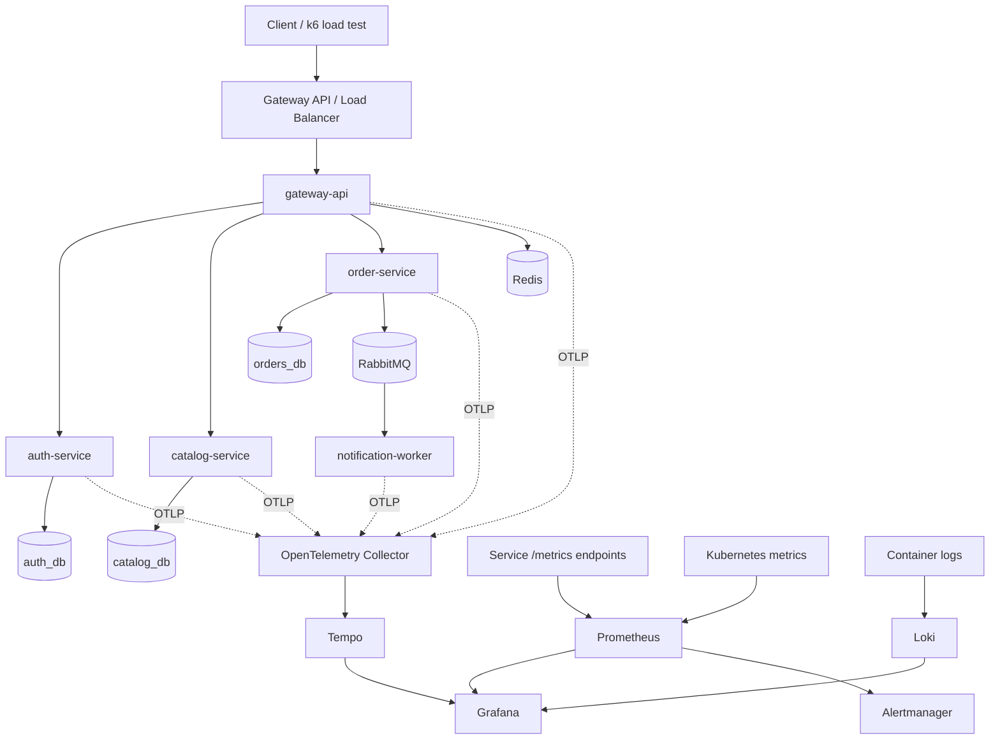
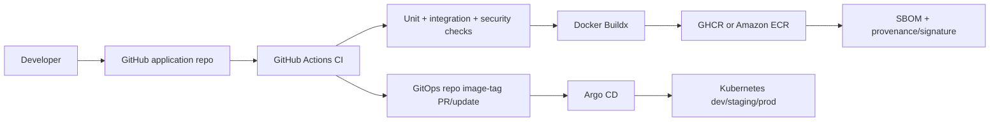

# Project 1 - Production Microservices Delivery Platform on Kubernetes

## Project identity

**Portfolio name:** `KubeCommerce Platform`  
**Primary goal:** Build, secure, deploy, observe, autoscale, and continuously deliver a production-style Python microservices application on Kubernetes.  
**Primary roles demonstrated:** Junior DevOps Engineer, Platform Engineer, Cloud Engineer, SRE-minded Software Engineer.  
**Difficulty:** Intermediate, intentionally achievable in stages.  
**Recommended implementation path:** Local Docker Compose -> local Kubernetes with kind/k3d -> AWS EKS production environment.  

This project is designed to prove that you can take an application from source code to a reliable production-style Kubernetes deployment rather than simply running a few `kubectl` commands.

---

# 1. What you will build

Build a small e-commerce/order-processing system using independently deployable Python services.

## Core microservices

| Service | Responsibility | Suggested technology | Data ownership |
|---|---|---|---|
| `gateway-api` | Public API entry point, request aggregation, correlation IDs | FastAPI | No persistent DB |
| `auth-service` | User registration/login, JWT issuance/validation | FastAPI | `auth_db` |
| `catalog-service` | Product catalog and inventory state | FastAPI | `catalog_db` |
| `order-service` | Create/read orders, validates inventory | FastAPI | `orders_db` |
| `notification-worker` | Consumes order events and sends simulated email/webhook notifications | Python worker | Event queue only |

## Shared infrastructure

- PostgreSQL for application persistence.
- Redis for caching, rate limiting, and short-lived application state.
- RabbitMQ for asynchronous `order.created` events.
- Kubernetes for orchestration.
- Helm for packaging deployments.
- GitHub Actions for CI and image publishing.
- Argo CD for GitOps continuous delivery.
- Prometheus, Grafana, and Alertmanager for monitoring and alerting.
- Loki for centralized logs.
- Tempo plus OpenTelemetry for distributed traces.
- Terraform for the optional EKS/cloud environment.

For a portfolio implementation, one PostgreSQL instance may host separate databases/users for the services to control cost. Document that a stricter production microservice architecture can isolate storage further when operational requirements justify it.

---

# 2. Architecture



## Delivery architecture



The important design rule is that CI builds and publishes artifacts, while Argo CD reconciles production deployment state from Git. The CI workflow should not need broad `kubectl` credentials to the production cluster.

---

# 3. Skills this project proves

By completion, the repository should visibly demonstrate:

- Linux and shell scripting.
- Git and GitHub pull-request workflows.
- Python application packaging.
- FastAPI and REST APIs.
- Unit and integration testing with `pytest`.
- Docker and multi-stage container builds.
- Docker Compose for local integration.
- Container registries: GHCR initially, ECR in AWS.
- Kubernetes Deployments, Services, ConfigMaps, Secrets, ServiceAccounts, namespaces, probes, requests/limits, HPA, PDB, topology spreading, RBAC, and NetworkPolicy.
- Kubernetes Gateway API based north-south routing.
- Helm charts and environment-specific values.
- GitHub Actions CI.
- GitOps CD with Argo CD.
- AWS IAM/OIDC and EKS Pod Identity on the cloud path.
- Prometheus/Grafana/Alertmanager.
- Centralized logging and tracing.
- OpenTelemetry instrumentation.
- Security scanning, SBOMs, signed/provenance-aware images.
- Load testing, failure testing, rolling deployment, rollback, and self-healing.

---

# 4. Recommended repository strategy

Use two repositories once the first local prototype works.

## Repository A - application source

```text
kubecommerce/
├── .github/
│   └── workflows/
│       ├── ci.yml
│       ├── release.yml
│       └── security.yml
├── services/
│   ├── gateway-api/
│   │   ├── app/
│   │   ├── tests/
│   │   ├── Dockerfile
│   │   └── pyproject.toml
│   ├── auth-service/
│   ├── catalog-service/
│   ├── order-service/
│   └── notification-worker/
├── libs/
│   └── observability/
├── compose.yaml
├── scripts/
│   ├── smoke-test.sh
│   ├── load-test.sh
│   └── dev-bootstrap.sh
├── tests/
│   └── integration/
├── .pre-commit-config.yaml
├── Makefile
└── README.md
```

## Repository B - GitOps/configuration

```text
kubecommerce-gitops/
├── bootstrap/
│   └── argocd/
├── charts/
│   └── kubecommerce/
│       ├── Chart.yaml
│       ├── values.yaml
│       └── templates/
├── environments/
│   ├── dev/
│   │   └── values.yaml
│   ├── staging/
│   │   └── values.yaml
│   └── prod/
│       └── values.yaml
├── platform/
│   ├── monitoring/
│   ├── logging/
│   ├── tracing/
│   ├── external-secrets/
│   └── gateway/
└── argocd/
    ├── project.yaml
    ├── applicationset.yaml
    └── root-app.yaml
```

Keep application code and desired deployment state separate because they have different review, access, and release lifecycles.

---

# 5. Environment design

Create three logical environments.

| Environment | Purpose | Suggested runtime |
|---|---|---|
| `dev` | Fast developer validation | kind/k3d or shared EKS namespace |
| `staging` | Production-like integration and release validation | kind/k3d initially, EKS later |
| `prod` | Demonstration of controlled release | EKS |

For a low-cost portfolio, dev and staging may initially be namespaces in one local cluster. In the cloud version, document that stronger isolation can mean separate clusters/accounts even if you use one cluster for the demonstration.

---

# 6. Step-by-step implementation plan

## Phase 0 - Establish engineering standards before coding

### Step 0.1 - Create project boards and documentation

Create:

- `README.md` with problem statement and architecture.
- `docs/architecture.md`.
- `docs/runbook.md`.
- `docs/security.md`.
- `docs/slo.md`.
- GitHub Issues for each phase below.
- GitHub Projects board with `Backlog`, `In Progress`, `Review`, and `Done`.

### Step 0.2 - Define naming conventions

Use predictable names such as:

- container image: `ghcr.io/<user>/kubecommerce-order-service:<git-sha>`
- namespaces: `kubecommerce-dev`, `kubecommerce-staging`, `kubecommerce-prod`
- Kubernetes labels:
  - `app.kubernetes.io/name`
  - `app.kubernetes.io/component`
  - `app.kubernetes.io/part-of`
  - `app.kubernetes.io/version`
  - `environment`

### Step 0.3 - Add local developer tooling

Recommended tools:

- Python 3.12+ or a currently supported Python release.
- `uv` or `pip-tools` for deterministic dependency management.
- Ruff for linting and formatting checks.
- MyPy for selected type checks.
- Pytest.
- pre-commit.
- Docker Engine/Desktop.
- `kubectl`.
- kind or k3d.
- Helm.
- `k9s` optional for cluster inspection.

Create a `Makefile` exposing a stable interface:

```text
make install
make lint
make test
make integration-test
make compose-up
make compose-down
make build
make kind-up
make helm-install
make smoke-test
make load-test
```

**Exit criterion:** a new developer can clone the repository and run `make install && make test` successfully.

---

## Phase 1 - Build the application as real microservices

### Step 1.1 - Implement `auth-service`

Minimum endpoints:

- `POST /users`
- `POST /login`
- `GET /me`
- `GET /health/live`
- `GET /health/ready`
- `GET /metrics`

Requirements:

- Hash passwords with a modern password hashing library.
- Issue short-lived JWT access tokens.
- Never log passwords or bearer tokens.
- Keep JWT secret/key outside source code.
- Persist users to `auth_db`.

### Step 1.2 - Implement `catalog-service`

Minimum endpoints:

- `POST /products`
- `GET /products`
- `GET /products/{id}`
- `PATCH /products/{id}/stock`
- health and metrics endpoints.

Use Redis for cacheable reads and invalidate the cache when product state changes.

### Step 1.3 - Implement `order-service`

Minimum endpoints:

- `POST /orders`
- `GET /orders/{id}`
- `GET /orders?user_id=...`

Order creation flow:

1. Validate request schema.
2. Check catalog/inventory availability.
3. Write order transaction.
4. Publish an `order.created` event to RabbitMQ.
5. Return an order ID and correlation ID.

Design event payloads explicitly and version them, e.g. `event_type`, `event_version`, `event_id`, `occurred_at`, `correlation_id`, and `data`.

### Step 1.4 - Implement `notification-worker`

Consume `order.created`. Do not call a real paid email provider for the base project. Log a structured notification event or expose a simulated webhook sink.

Implement:

- retry with exponential backoff;
- dead-letter queue;
- idempotency using event ID;
- metrics for successful/failed processing.

### Step 1.5 - Implement the public `gateway-api`

Responsibilities:

- verify auth tokens;
- route/aggregate API calls;
- attach `X-Correlation-ID`;
- enforce a simple rate limit via Redis;
- return consistent error schemas;
- expose health and Prometheus metrics.

Avoid putting business logic in the gateway.

### Step 1.6 - Add database migration tooling

Use Alembic for each database-owning service.

Rules:

- schema changes must be versioned;
- migrations run as an explicit Kubernetes Job or release step, not opportunistically by every replica on startup;
- design backward-compatible migrations for rolling deployments.

**Exit criterion:** the complete system works with services running as normal local Python processes.

---

## Phase 2 - Test the application before containerization

### Step 2.1 - Unit tests

Target tests for:

- auth token creation/validation;
- order state transitions;
- inventory validation;
- cache invalidation;
- RabbitMQ event payload creation;
- idempotent notification processing;
- error handling.

Do not optimize for an arbitrary 100% coverage number. Set a meaningful minimum gate, for example 80%, and require critical business paths to be tested.

### Step 2.2 - Contract tests

Validate service API schemas with OpenAPI and tests that confirm expected request/response contracts.

### Step 2.3 - Integration tests

Use Docker Compose services in CI or testcontainers to start PostgreSQL, Redis, and RabbitMQ.

Test a complete flow:

```text
register -> login -> create product -> create order -> event -> notification worker
```

### Step 2.4 - Failure tests

Include controlled tests for:

- Redis unavailable;
- RabbitMQ unavailable;
- database connection failure;
- downstream catalog timeout;
- duplicate event consumption.

**Exit criterion:** CI-testable application behavior exists before Kubernetes is introduced.

---

## Phase 3 - Containerize each service professionally

### Step 3.1 - Create multi-stage Dockerfiles

Each image should:

- use a small pinned base image by digest for release builds where practical;
- install only runtime dependencies in the final image;
- create a non-root user;
- expose only the required port;
- have no compilers/package managers unless needed at runtime;
- use `PYTHONDONTWRITEBYTECODE=1` and unbuffered logs if appropriate;
- include OCI labels such as source repository and revision.

### Step 3.2 - Add `.dockerignore`

Exclude:

- `.git`;
- test caches;
- local virtual environments;
- `.env` files;
- notebooks not required at runtime;
- documentation and development artifacts not needed in the image.

### Step 3.3 - Build for reproducibility

Use Docker Buildx and immutable image tags:

- `<git-sha>` as the deployment identity;
- semantic version tag for human releases;
- never deploy a mutable `latest` tag to production.

### Step 3.4 - Local Compose integration

`compose.yaml` should start:

- all five services;
- PostgreSQL;
- Redis;
- RabbitMQ;
- optional local Prometheus/Grafana profile.

Define health checks and dependency readiness without relying solely on startup ordering.

**Exit criterion:** `docker compose up --build` produces a complete functioning system.

---

## Phase 4 - Create a local Kubernetes platform

### Step 4.1 - Create a kind/k3d cluster

Automate cluster creation in `scripts/kind-up.sh` or a Make target.

Install:

- Gateway API CRDs;
- a Gateway API implementation such as Envoy Gateway for local use;
- Metrics Server for HPA resource metrics;
- Argo CD later in Phase 8.

### Step 4.2 - Create namespaces

At minimum:

```text
kubecommerce-dev
platform-system
monitoring
observability
argocd
```

### Step 4.3 - Kubernetes configuration for every stateless service

Create:

- Deployment;
- ClusterIP Service;
- ConfigMap for non-secret configuration;
- ServiceAccount;
- liveness probe;
- readiness probe;
- startup probe where startup can be slow;
- CPU/memory requests;
- CPU/memory limits;
- rolling update strategy;
- security context.

Recommended container security baseline:

```yaml
securityContext:
  runAsNonRoot: true
  allowPrivilegeEscalation: false
  readOnlyRootFilesystem: true
  capabilities:
    drop: ["ALL"]
```

Use a writable `emptyDir` only for paths that actually require temporary writes.

### Step 4.4 - Health probe behavior

- **Startup probe:** verifies process initialization has completed.
- **Readiness probe:** verifies the pod may receive traffic. A temporarily failed dependency may mark readiness false.
- **Liveness probe:** detects a stuck application and triggers restart; do not make it so dependency-sensitive that a database outage restarts every application pod.

### Step 4.5 - Resource management

Start with measured development values rather than arbitrary limits. Example only:

```yaml
resources:
  requests:
    cpu: 100m
    memory: 128Mi
  limits:
    cpu: 500m
    memory: 512Mi
```

Load-test, observe actual usage, then adjust.

### Step 4.6 - Configure the HorizontalPodAutoscaler

Start with HPA v2 on CPU utilization:

- `minReplicas: 2` for user-facing services in staging/prod;
- `maxReplicas: 10`;
- target CPU around 60-70% after measurement;
- scale-down stabilization window to avoid flapping.

Later add a queue-depth based autoscaling path for `notification-worker` with KEDA as an advanced extension.

### Step 4.7 - Add PodDisruptionBudgets

For replicated user-facing services, ensure voluntary cluster maintenance cannot evict all replicas at once.

Example intent:

```text
replicas = 3
PDB minAvailable = 2
```

### Step 4.8 - Add topology spread constraints

Spread replicas across nodes and, on EKS, across availability zones where available. This demonstrates failure-domain-aware scheduling.

### Step 4.9 - Add NetworkPolicies

Use default-deny ingress and egress as the target state, then explicitly allow required flows such as:

```text
gateway-api -> auth/catalog/order
order-service -> catalog-service
services -> PostgreSQL/Redis/RabbitMQ
monitoring -> application metrics ports
OpenTelemetry collector traffic
DNS
```

Pick a CNI that enforces NetworkPolicy in the chosen environment. Document that a NetworkPolicy object does nothing if the CNI does not implement it.

### Step 4.10 - Add routing using Gateway API

Define:

- `GatewayClass` via the chosen controller;
- `Gateway` with HTTP/HTTPS listeners;
- `HTTPRoute` for public API traffic.

Suggested routes:

```text
/api/auth/*     -> auth via gateway-api or direct route according to design
/api/catalog/*  -> gateway-api
/api/orders/*   -> gateway-api
```

Keep PostgreSQL, Redis, RabbitMQ, Prometheus, and internal services private.

**Exit criterion:** kill an application pod and observe traffic continue while Kubernetes replaces it.

---

## Phase 5 - Package deployments with Helm

### Step 5.1 - Build one umbrella chart or reusable service subchart

A strong portfolio pattern is a reusable `microservice` library/subchart plus values for each service.

Configurable values should include:

- image repository/tag/digest;
- replica count;
- service port;
- resources;
- HPA values;
- probes;
- environment variables;
- service account;
- pod security context;
- topology spreading;
- PDB;
- ServiceMonitor;
- annotations/labels.

### Step 5.2 - Create environment values

```text
values-dev.yaml
values-staging.yaml
values-prod.yaml
```

Do not store plaintext production secrets in any of these files.

### Step 5.3 - Validate charts

CI should run:

- `helm lint`;
- `helm template`;
- schema validation using `values.schema.json` if implemented;
- Kubernetes manifest policy/security scanning.

**Exit criterion:** one command can render or install each environment consistently.

---

## Phase 6 - Secrets and configuration management

### Step 6.1 - Local environment

For local Kubernetes, use one of:

- SOPS + age encrypted secrets;
- a local secret manager;
- generated Kubernetes Secrets excluded from Git.

### Step 6.2 - AWS environment

Use AWS Secrets Manager and External Secrets Operator.

Use EKS Pod Identity or another short-lived workload identity mechanism instead of embedding AWS access keys in Kubernetes Secrets.

Example secret ownership:

```text
/prod/kubecommerce/auth/jwt-signing-key
/prod/kubecommerce/database/auth-url
/prod/kubecommerce/database/orders-url
/prod/kubecommerce/rabbitmq/password
```

### Step 6.3 - Rotation test

Demonstrate one credential rotation without rebuilding the application image. Document how the secret is refreshed/reloaded and whether the application needs a restart.

**Exit criterion:** no long-lived cloud key or production credential is committed to GitHub.

---

## Phase 7 - Build a production-style GitHub Actions CI pipeline

### Step 7.1 - Pull request pipeline

Trigger on pull requests.

Jobs:

1. `lint`
   - Ruff;
   - format check;
   - MyPy where configured.
2. `unit-test`
   - Pytest;
   - coverage gate.
3. `integration-test`
   - start required backing services;
   - execute cross-service tests.
4. `dependency-security`
   - dependency review / vulnerability scanning.
5. `code-security`
   - CodeQL for Python where suitable.
6. `container-config-security`
   - Trivy filesystem/secret/misconfiguration scan;
   - Helm/manifests scan.
7. `helm-validation`
   - lint/template.

Branch protection should require these jobs before merge.

### Step 7.2 - Main branch build pipeline

After tests pass:

1. calculate image tag from Git SHA;
2. authenticate to registry;
3. build each changed service with Buildx;
4. scan final image;
5. push image;
6. create SBOM;
7. create artifact/build provenance attestation;
8. optionally sign the image with Cosign keyless signing;
9. publish release metadata.

### Step 7.3 - Authenticate to AWS without static keys

For ECR or other AWS operations, configure GitHub Actions OIDC federation to an AWS IAM role with narrowly scoped permissions.

Do not store an AWS access key/secret pair as ordinary long-lived repository secrets.

### Step 7.4 - Optimize monorepo builds

Use path filters or a change-detection job so editing `catalog-service` does not rebuild every service unnecessarily.

**Exit criterion:** a merge to main automatically produces a tested, scanned, immutable container artifact.

---

## Phase 8 - Implement GitOps CD with Argo CD

### Step 8.1 - Install Argo CD

Bootstrap it manually once or via Terraform/Helm.

Create an Argo CD project limiting:

- allowed source repositories;
- target clusters;
- target namespaces;
- privileged resource kinds where possible.

### Step 8.2 - App-of-apps or ApplicationSet

Use an `ApplicationSet` for dev/staging/prod or for multiple microservices.

### Step 8.3 - Development promotion

After CI publishes a new image:

- CI opens a PR or commits a change to the dev GitOps values;
- Argo CD detects the Git change;
- Argo CD syncs dev;
- smoke tests run.

### Step 8.4 - Staging promotion

Promote the same immutable image SHA/digest to staging after dev checks. Do not rebuild a different artifact for staging.

### Step 8.5 - Production promotion

Use a pull request and GitHub environment approval before modifying the production image reference.

The desired production release is therefore auditable in Git.

### Step 8.6 - Self-healing demo

With Argo CD self-heal enabled for the demo environment:

1. manually change a Deployment replica count with `kubectl`;
2. show Argo CD reporting drift;
3. show reconciliation back to the Git-declared value.

**Exit criterion:** the production cluster is deployed from GitOps desired state, not from a workstation.

---

## Phase 9 - Add monitoring with Prometheus, Grafana, Alertmanager

### Step 9.1 - Install Kubernetes monitoring stack

Use the Prometheus Operator ecosystem, commonly through a Helm distribution such as `kube-prometheus-stack`.

Collect:

- Kubernetes control/workload metrics;
- node metrics;
- kube-state-metrics;
- application metrics.

### Step 9.2 - Instrument each FastAPI service

Expose Prometheus metrics including:

- request count;
- request duration histogram;
- response status count;
- in-flight requests;
- dependency latency;
- DB errors;
- cache hit/miss rate;
- RabbitMQ publish/consume failures.

Avoid unbounded labels such as raw user IDs or URLs containing IDs.

### Step 9.3 - Create ServiceMonitor resources

Use ServiceMonitor/PodMonitor resources to declare how Prometheus should discover application metrics.

### Step 9.4 - Build the required Grafana dashboards

Create and version dashboard JSON or provisioning files in Git.

#### Dashboard A - Kubernetes workload health

Panels:

- CPU usage by pod/service;
- memory working set;
- requested vs actual CPU/memory;
- pod restarts;
- unavailable replicas;
- HPA desired/current replicas;
- node pressure;
- pod phase counts.

#### Dashboard B - API RED metrics

RED = Rate, Errors, Duration.

Panels:

- requests/sec by service;
- 2xx/4xx/5xx rate;
- p50/p95/p99 response latency;
- error percentage;
- top endpoints by traffic;
- dependency latency.

#### Dashboard C - messaging/database

Panels:

- RabbitMQ queue depth;
- publish/consume rate;
- dead-letter count;
- PostgreSQL connection usage;
- Redis cache hit rate.

### Step 9.5 - Define PrometheusRule alerts

Start with alerts such as:

- service 5xx rate > 5% for 5 minutes;
- p95 latency > 750 ms for 10 minutes;
- pod restart count increasing repeatedly;
- deployment unavailable replicas > 0 for 5 minutes;
- memory usage near container limit;
- HPA stuck at maximum replicas;
- dead-letter queue non-empty;
- no successful requests during expected traffic window.

Tune values after load tests to reduce alert noise.

### Step 9.6 - Configure Alertmanager routing

For a portfolio demonstration, route alerts to:

- email;
- a Slack/Discord webhook if available;
- a local webhook receiver service.

Demonstrate grouping, silencing, and severity routing.

**Exit criterion:** create load and a controlled failure, then show dashboard changes and at least one alert firing and resolving.

---

## Phase 10 - Add logs and distributed traces

### Step 10.1 - Structured application logs

All services should log JSON with fields such as:

- timestamp;
- severity;
- service;
- environment;
- correlation ID;
- trace ID;
- request method/path template;
- status;
- duration;
- safe error category.

Never log credentials, tokens, full card-like data, or user passwords.

### Step 10.2 - Centralized logs with Loki

Deploy Loki and a log collector such as Grafana Alloy. Send Kubernetes/container logs to Loki.

Build Grafana log views that filter by:

- service;
- namespace;
- severity;
- correlation ID.

### Step 10.3 - OpenTelemetry tracing

Instrument FastAPI HTTP clients/server calls and relevant database/messaging operations.

Run OpenTelemetry Collector in Kubernetes and export traces to Tempo.

### Step 10.4 - Cross-signal debugging demo

Demonstrate:

1. Grafana alert indicates high order latency.
2. Open a trace for a slow request.
3. Identify the slow downstream service span.
4. Pivot to logs using trace ID.
5. View the correlated service metric.

This is a strong interview demonstration because it shows operational debugging, not just dashboard creation.

---

## Phase 11 - Reliability and self-healing engineering

### Step 11.1 - Rolling updates

Set rolling strategy to preserve capacity during deployments. Validate that traffic remains available while replacing pods.

### Step 11.2 - Graceful shutdown

FastAPI services should:

- handle SIGTERM;
- stop accepting new work;
- complete in-flight requests when possible;
- close DB/message connections;
- terminate within `terminationGracePeriodSeconds`.

### Step 11.3 - Resilience patterns

Implement where appropriate:

- client timeouts;
- bounded retries with jitter;
- circuit-breaker behavior or failure isolation;
- idempotency keys for order creation;
- dead-letter queue;
- connection pooling.

Avoid retries on non-idempotent operations unless the request has a safe idempotency mechanism.

### Step 11.4 - HPA demo

Use k6 to increase request load and capture evidence showing:

```text
2 pods -> 3 -> 5+ pods -> load ends -> controlled scale-down
```

### Step 11.5 - Crash recovery demo

Create a safe endpoint or temporary test build that causes one container to become unhealthy. Show:

```text
liveness failure -> restart -> readiness recovers -> traffic resumes
```

### Step 11.6 - Node/pod disruption demo

Delete a pod or drain a local worker node. Show PDB/topology configuration preserving service availability where the test environment permits it.

**Exit criterion:** the README contains screenshots/logs proving autoscaling, restarts, and rolling deployment behavior.

---

## Phase 12 - Security hardening

### Step 12.1 - Repository security

Enable:

- branch protection;
- required reviews;
- Dependabot/Renovate;
- secret scanning where available;
- CODEOWNERS;
- least-privilege workflow permissions.

Pin third-party GitHub Actions to immutable commit SHAs for higher assurance on critical pipelines.

### Step 12.2 - Software supply chain

Pipeline should produce:

- immutable image digest;
- vulnerability report;
- SBOM;
- build provenance/attestation;
- signature if using Cosign.

Set a release gate that blocks known Critical vulnerabilities unless an explicit documented exception exists.

### Step 12.3 - Kubernetes security

Apply:

- non-root containers;
- seccomp `RuntimeDefault` where supported;
- dropped Linux capabilities;
- read-only root filesystem;
- dedicated service accounts;
- `automountServiceAccountToken: false` where Kubernetes API access is not needed;
- RBAC least privilege;
- NetworkPolicies;
- namespace-level Pod Security Admission labels appropriate for the workloads.

### Step 12.4 - Policy as code

Add Kyverno or Gatekeeper policies such as:

- disallow privileged containers;
- require resource requests/limits;
- require non-root execution;
- disallow `latest` image tags;
- require approved image registries;
- require probes for production Deployments.

Start in audit mode, remediate violations, then enforce selected policies.

**Exit criterion:** a deliberately insecure test manifest is rejected by CI and/or cluster policy.

---

## Phase 13 - AWS EKS production path

This phase can reuse infrastructure from Project 2 rather than duplicate it.

### Step 13.1 - Required cloud resources

Provision with Terraform:

- VPC and subnets;
- EKS;
- ECR;
- PostgreSQL through RDS if budget permits;
- Secrets Manager;
- DNS/TLS resources;
- IAM roles;
- monitoring storage where needed.

### Step 13.2 - Workload identity

Use one IAM role per application/controller when AWS API access is required. Prefer EKS Pod Identity in a modern EKS deployment and grant only required actions/resources.

Examples:

- External Secrets Operator -> read selected Secrets Manager paths;
- application service -> only selected S3 bucket, if used;
- AWS Load Balancer Controller -> required ELB APIs.

### Step 13.3 - Public routing

Use a supported Gateway API implementation. On AWS, evaluate the current AWS Load Balancer Controller Gateway API feature/conformance status before selecting it for the final path. Alternatively run a portable Gateway API implementation and expose its service through an AWS load balancer.

### Step 13.4 - TLS and DNS

Use a real domain only if desired. Automate DNS and certificate management where possible. Do not expose internal observability endpoints publicly without authentication.

### Step 13.5 - Cloud cost controls

- Create an AWS Budget before long-running deployment.
- Use the smallest reasonable managed node sizes.
- Tear down nonessential environments when not demonstrating them.
- Do not leave NAT gateways/load balancers/databases running unintentionally.
- Tag resources with `project`, `environment`, `owner`, and `managed-by=terraform`.

**Exit criterion:** application is reachable through HTTPS, deployed by GitOps, with no static AWS keys in GitHub.

---

# 7. CI/CD release flow to demonstrate in an interview

```text
1. Developer opens pull request
2. Ruff/MyPy/Pytest run
3. Integration tests run
4. Trivy and code/security checks run
5. Helm manifests validate
6. Reviewer approves and merges
7. GitHub Actions builds changed service images
8. Images receive immutable Git SHA tags
9. Image vulnerability scan passes
10. SBOM + provenance/signature created
11. Images pushed to GHCR/ECR
12. CI updates dev GitOps image tag
13. Argo CD syncs dev
14. Smoke tests run
15. Same image digest promoted to staging
16. Staging k6/smoke tests pass
17. Production GitOps PR is reviewed/approved
18. Argo CD performs rolling production deployment
19. Prometheus/Grafana verifies health
20. Rollback = revert GitOps commit or promote previous image digest
```

---

# 8. Observability requirements checklist

Your final project should visibly include all of the following.

| Signal | Required evidence |
|---|---|
| CPU | Grafana panel by service/pod |
| Memory | working set and limit comparison |
| Pod restarts | graph/table with restart count |
| Request rate | requests/sec per service |
| Response time | p50/p95/p99 latency |
| Error rate | 4xx/5xx and percentage |
| HPA | desired/current replicas |
| Queue | RabbitMQ queue depth and failures |
| Logs | Loki query with correlation IDs |
| Traces | distributed request trace in Tempo |
| Alerts | at least 5 useful Prometheus rules |

---

# 9. SLO exercise

Define one explicit service-level objective for the public API.

Example portfolio SLO:

```text
Availability SLO: 99.9% successful requests over a rolling 30-day window.
Latency SLO: 95% of valid API requests complete below 500 ms.
```

Define what counts as a successful request and exclude only intentional client errors where justified.

Create Grafana panels for:

- SLI success ratio;
- SLO target;
- error budget remaining;
- burn-rate style alerting as an advanced extension.

The numbers are demonstration targets, not claims of real-world service reliability unless you have measured them for the stated period.

---

# 10. Testing matrix

| Layer | Tool/examples | Gate |
|---|---|---|
| Python lint/format | Ruff | PR must pass |
| Unit tests | Pytest | PR must pass |
| API contract | Pytest/OpenAPI | PR must pass |
| Integration | Compose/testcontainers | PR must pass |
| Container | Trivy | no unaccepted Critical issues |
| IaC/K8s config | Trivy config/policy tests | PR must pass |
| Helm | helm lint/template | PR must pass |
| Smoke | curl/Pytest | after deployment |
| Load | k6 | staging/release |
| Resilience | pod kill/failure injection | documented demo |
| Security policy | Kyverno/Gatekeeper tests | prod policy gate |

---

# 11. Definition of Done

The project is portfolio-ready only when you can prove these outcomes:

- [ ] Five independently containerized Python components exist.
- [ ] Local Compose environment works.
- [ ] Local Kubernetes deployment works.
- [ ] Helm packages the application.
- [ ] Config and secrets are separated.
- [ ] All services have meaningful readiness/liveness behavior.
- [ ] Requests/limits are defined and justified after testing.
- [ ] HPA visibly scales under load.
- [ ] Multiple replicas survive pod termination.
- [ ] PDB and topology spreading are present for production services.
- [ ] NetworkPolicy is implemented and tested.
- [ ] CI runs tests/security checks.
- [ ] Registry images are immutable and scanned.
- [ ] SBOM/provenance exists.
- [ ] GitOps deployment works through Argo CD.
- [ ] Prometheus scrapes application metrics.
- [ ] Grafana dashboards show CPU, memory, restarts, request rate, latency, and errors.
- [ ] Alertmanager notification is demonstrated.
- [ ] Loki logs are searchable.
- [ ] OpenTelemetry traces are viewable in Tempo.
- [ ] Rolling update and rollback are demonstrated.
- [ ] README contains architecture, setup, screenshots, demo script, and trade-offs.

---

# 12. Suggested implementation milestones

## Milestone 1 - Application foundation

Deliver:

- services;
- databases/queue;
- unit tests;
- Compose.

## Milestone 2 - Kubernetes basics

Deliver:

- Deployments/Services;
- probes;
- resources;
- ConfigMaps/Secrets;
- Gateway routing.

## Milestone 3 - Reliability

Deliver:

- HPA;
- PDB;
- multiple replicas;
- topology spreading;
- NetworkPolicy;
- load tests.

## Milestone 4 - CI/CD

Deliver:

- GitHub Actions;
- registry;
- scans;
- SBOM/provenance;
- GitOps repo;
- Argo CD.

## Milestone 5 - Observability

Deliver:

- Prometheus;
- Grafana;
- Alertmanager;
- Loki;
- OpenTelemetry + Tempo.

## Milestone 6 - Cloud deployment

Deliver:

- EKS deployment;
- workload identity;
- cloud secrets;
- HTTPS;
- final evidence and demo.

---

# 13. Demo script for a recruiter/interviewer

Use a 7-10 minute demo.

1. Show the architecture diagram.
2. Open a PR and show CI gates.
3. Show container image SHA/digest and security/SBOM output.
4. Merge and show GitOps desired-state change.
5. Show Argo CD syncing the release.
6. Generate traffic with k6.
7. Show HPA scaling pods.
8. Show Grafana request rate, p95 latency, CPU, and memory.
9. Kill a pod and show self-healing.
10. Trigger a controlled error and show Alertmanager.
11. Open a distributed trace and correlated logs.
12. Revert a GitOps release and show rollback.

This demonstrates an operational lifecycle rather than a static repository.

---

# 14. Resume bullets after completion

Use only claims you actually implemented and measured.

- Built and operated a Python/FastAPI microservices platform on Kubernetes with Helm, health probes, resource controls, HPA, PodDisruptionBudgets, topology spreading, NetworkPolicies, and rolling deployments.
- Implemented GitHub Actions CI with automated testing, container/IaC security scanning, immutable image publishing, SBOM/provenance generation, and GitOps delivery through Argo CD.
- Implemented full-stack observability using Prometheus, Grafana, Alertmanager, Loki, OpenTelemetry, and Tempo, including RED dashboards, Kubernetes resource monitoring, distributed traces, and actionable alerts.
- Deployed the platform to AWS EKS using short-lived workload/cloud identities and externally managed secrets, and validated autoscaling, self-healing, controlled rollout, and rollback under load.

---

# 15. Interview questions you should be able to answer from this project

- Why does readiness differ from liveness?
- What happens when a readiness probe fails?
- Why can badly designed liveness probes cause an outage?
- Why use requests and limits?
- How does HPA obtain CPU metrics?
- What is the difference between an HPA and a cluster/node autoscaler?
- What problem does a PDB solve, and what does it not protect against?
- Why use topology spread constraints?
- How do Kubernetes Services route traffic to pods?
- Why use Gateway API rather than relying on a legacy ingress-controller-specific design?
- Why should CI not directly mutate production with broad cluster credentials?
- What does GitOps self-healing mean?
- How do you roll back safely?
- Why use immutable image digests?
- What is an SBOM?
- Why prefer OIDC to static AWS keys in GitHub Actions?
- What are RED metrics?
- What causes high-cardinality Prometheus labels and why is it a problem?
- How do traces, logs, and metrics complement one another?
- How would you debug a `CrashLoopBackOff`?
- How would you debug a pod that is Running but receives no traffic?

---

# 16. Optional advanced extensions

Do these only after the core project is complete.

- Argo Rollouts canary/blue-green deployment.
- KEDA scaling of `notification-worker` from RabbitMQ depth.
- mTLS/service mesh using Cilium service mesh, Istio, or Linkerd.
- eBPF observability with Cilium/Hubble.
- chaos tests with Chaos Mesh or Litmus.
- multi-cluster GitOps.
- ExternalDNS.
- automated TLS with cert-manager where compatible with the selected Gateway setup.
- Prometheus remote write to managed long-term storage.
- OpenFeature feature flags.

Avoid adding advanced tooling simply for a logo list. Every added component should solve a documented problem and have a tested failure/operational story.

---

# 17. Current-practice notes and authoritative references

The implementation choices above are deliberately aligned with current platform practices:

- Kubernetes probe behavior: https://kubernetes.io/docs/concepts/workloads/pods/probes/
- Kubernetes HPA: https://kubernetes.io/docs/concepts/workloads/autoscaling/horizontal-pod-autoscale/
- Kubernetes PodDisruptionBudget/disruptions: https://kubernetes.io/docs/concepts/workloads/pods/disruptions/
- Kubernetes topology spread constraints: https://kubernetes.io/docs/concepts/scheduling-eviction/topology-spread-constraints/
- GitHub Actions security/OIDC/attestations: https://docs.github.com/en/actions/how-tos/secure-your-work
- Argo CD automated synchronization: https://argo-cd.readthedocs.io/en/stable/user-guide/auto_sync/
- Prometheus alerting/Alertmanager: https://prometheus.io/docs/alerting/latest/overview/
- Prometheus Operator CRDs: https://prometheus-operator.dev/docs/api-reference/api/
- OpenTelemetry Collector on Kubernetes: https://opentelemetry.io/docs/collector/install/kubernetes/
- External Secrets Operator AWS Secrets Manager provider: https://external-secrets.io/latest/provider/aws-secrets-manager/
- AWS EKS identity/IAM best practices: https://docs.aws.amazon.com/eks/latest/best-practices/identity-and-access-management.html
- AWS Load Balancer Controller Gateway API: https://kubernetes-sigs.github.io/aws-load-balancer-controller/latest/guide/gateway/gateway/
- Trivy IaC/misconfiguration scanning: https://trivy.dev/docs/latest/scanner/misconfiguration/

> Maintenance rule: pin tested versions in the repository and update deliberately through dependency automation. Do not copy version numbers from this plan blindly months later; validate compatibility between Kubernetes, Helm charts, CRDs, and controllers before upgrades.
